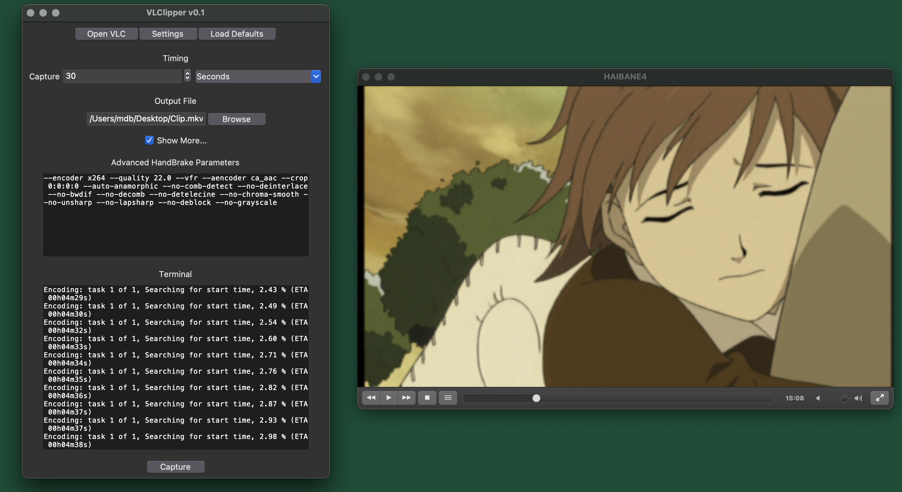

# VLClipper
### Make pulling clips from DVDs easy(ish).
VLClipper is a cross-platform utility written in python and powered by [VLC](https://www.videolan.org/vlc/) and [HandBrake](https://handbrake.fr/) that allows you to easily watch a DVD, press "Capture", and then get a short clip exported without (much) hassle.

To get VLClipper up and running on your system, head over to the [installation page](https://github.com/vunderscorei/VLClipper/wiki/Setup). To learn how it all works and how to use it, head over to the [usage page](https://github.com/vunderscorei/VLClipper/wiki/Usage).

VLClipper is currently in pre-alpha, and is quite unstable. Some major (known) issues include:
1. Program will crash if you use anything other than a (physical) DVD
2. Program will crash if VLC is already open beforehand
3. If VLC, HandBrake, or libdvdcss aren't confiugred properly, the program will crash
4. If VLClipper crashes, it doesn't properly close its child processes running in the background

Current planned features include:
1. Proper Linux support
2. Support for disk images and regular media files
3. Blu-ray suppport via MakeMKV integration
4. A better icon
5. Windows installer
6. Log files
